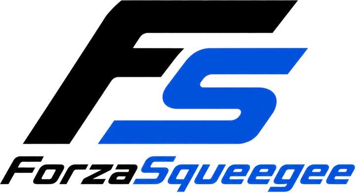

<p align="center">
  <picture>
    <source media="(prefers-color-scheme: dark)" srcset="docs/logo-dark.png">
    
  </picture>
</p>

<p align="center">포르자 호라이즌 6 리버리 제작 보조 프로그램</p>

---

FH6에는 이미지를 그대로 불러오는 기능이 없습니다. 리버리를 그리려면 벡터 도형을
수천 장 쌓아 올리는 수밖에 없죠. ForzaSqueegee는 그 수천 장을 대신 설계해 줍니다.

이미지 한 장을 넣으면 **인게임 비닐 그룹의 도형 레이어**로 분해해서, 게임이 바로
읽을 수 있는 파일로 저장합니다. 게임 창은 건드릴 필요도 없고, 몇 초면 끝납니다.

## 준비물

| | |
|---|---|
| OS | Windows 11 (HDR은 꺼 주세요) |
| 파이썬 | **따로 필요 없습니다** — 첫 실행 때 전용 파이썬을 이 폴더 안에 받아 둡니다 |
| 게임 | FH6, **창 모드**. Steam판은 알아서 찾고, 그 외에는 폴더를 직접 지정 |
| 디스크 | 저장소 50MB + 전용 파이썬·패키지 900MB + 모델 332MB |

## 설치와 실행

받은 폴더에서 **`ForzaSqueegee.bat`을 더블클릭**하면 됩니다. 창이 뜨면 이미지를
끌어다 놓고, 레이어 수를 정한 뒤 생성을 누르세요.

처음 실행할 때 전용 파이썬(3.12 임베더블, 11MB)과 필요한 패키지(PySide6 ·
OpenCV · NumPy · Pillow · onnxruntime, 내려받기 약 310MB)를 **전부 이 폴더의
`runtime/` 안에** 받아 둡니다. 다 놓이면 약 900MB를 차지하고(그중 640MB가
PySide6), 회선이 빠르면 1분 남짓이면 끝납니다. PC에 깔린 파이썬·아나콘다·다른
버전의 패키지가 뭐가 있든 **서로 전혀 닿지 않습니다** — 전용 파이썬은
PYTHONPATH도 레지스트리도 안 읽습니다. 지울 때는 폴더를 지우면 끝입니다.
(예전 판이 만들어 둔 `.venv`가 아직 핀과 맞으면 그대로 씁니다.)

파이썬과 패키지는 **버전을 고정해 뒀습니다**([pyproject.toml](pyproject.toml)).
도형을 배치하는 단계가 수치 최적화라 NumPy나 onnxruntime 버전이 다르면 다른
국소 최적해에 앉기 때문입니다.

명령줄이 익숙하다면 — 아래 예시들의 `python`은 함께 받아 둔
`runtime\python.exe`로 읽으세요 (직접 관리하는 파이썬 3.12~3.14에 핀 그대로
깔아 써도 됩니다):

```
runtime\python.exe -m forzasqueegee make 그림.png -o out/내도안
```

선화 추출·배경 제거·업스케일에 쓰는 ONNX 모델 4종(합쳐서 332MB)은 저장소에 없고,
**처음 필요해지는 순간 릴리스에서 자동으로 받아 옵니다.** 한 번 받으면 `models/`에
남기 때문에 다음부터는 네트워크를 쓰지 않습니다. 모델이 없어도 프로그램은 돌아가고
(배경 제거는 건너뛰고, 선화는 고전 알고리즘, 확대는 바이큐빅으로 대체합니다),
`line` 노선만 선화 모델이 반드시 필요합니다.

```
python -m forzasqueegee models           # 미리 다 받아 두기
python -m forzasqueegee models --check   # 뭐가 있고 없는지 확인
python -m forzasqueegee models --verify  # 받아 둔 파일 SHA-256 검증
```

## 기능

### 도안 만들기

노선 세 가지 중에 고릅니다.

| 노선 | 설명 |
|---|---|
| `cel` | **기본값.** 선을 먼저 긋고 그 아래를 색면으로 채웁니다. 색이 선 밖으로 새지 않고 빈틈도 없습니다. 값어치를 하는 레이어만 놓기 때문에 레이어 예산을 억지로 다 쓰지는 않습니다 |
| `line` | 원화에서 **선만** 딴 선화 도안. 면 채움이 없어서 차 도색 위에 선화만 얹힙니다. 원화에 선이 그려져 있어야 쓸 수 있습니다 |
| `painter` | KFPS와 같은 방식. **GPU**(OpenCL/Vulkan)로 회전 타원과 사각형을 쌓아 올립니다 |

```
python -m forzasqueegee make 그림.png -o out/내도안 --route line --shapes 1200
```

노선, 레이어 수, 배경 제거(`--keep-bg`), 크롭(`--no-crop`)은 **사람이 직접 고르는
값입니다.** 그림체와 의도에 따라 답이 갈리는 부분이라 자동으로 정할 수가 없습니다.

결과물은 `out/내도안/`에 들어가고, 파일 이름 앞에는 폴더 이름이 붙습니다.

| 파일 | 내용 |
|---|---|
| `내도안.plan.json` | 도형 레이어 목록 — 아래 명령들이 전부 이 파일을 받습니다 |
| `내도안.preview.png` | 완성 예상도 |
| `LayerGroup_내도안/` | 게임이 읽는 비닐 그룹 컨테이너 |
| `내도안.3so` · `내도안.kfps.json` | 편집기용 프로젝트 파일 |
| `내도안.report.json` | 자체 점검 결과 (커버리지·구멍·예산) |

### 차에 올리기

**1. 파일로 저장 (기본, 권장).** `make`가 도안 옆에 만들어 둔
`LayerGroup_내도안/`을 게임 저장 컨테이너 루트에 넣으면 인게임 '내 비닐 그룹'에
그대로 뜹니다. 다른 경로로 다시 써 주고 싶을 때는:

```
python -m forzasqueegee flsexport out/내도안/내도안.plan.json -o "<저장 컨테이너 루트>"
```

**3,000장짜리도 몇 초**면 끝납니다. 반대로 가져오는 것도 됩니다 — `.3so`, `C_group`,
`C_livery` 무엇이든 도안으로 바꿔 줍니다:

```
python -m forzasqueegee flsimport "<...>/LayerGroup_남의도안" -o out/flsimport
```

**2. 오버레이 보면서 직접 그리기.** 게임 창 위에 클릭이 통과하는 반투명 창을
띄웁니다. ← → 로 레이어를 넘기고, 모드가 셋입니다 — **도안**(완성 예상도를 통째로
겹쳐 보기) · **단계**(지금 그릴 레이어 하나만 강조하고 도형 종류·위치·크기·회전을
옆 패널에 표시, 끝낸 레이어는 흐려집니다) · **원본**(원화를 반투명으로 깔기).
게임에서 P로 격자를 켜고 [자동 보정]을 누르면 픽셀/유닛 배율을 알아서 맞춥니다.

```
python -m forzasqueegee overlay out/내도안/내도안.plan.json
```

**3. 프로그램이 대신 그리기.** `run`은 게임 창에 키 입력을 넣어 대신 그립니다.
진행 상황이 저장돼서 다시 실행하면 이어서 하고, 멈추려면 `STOP` 파일을 만들거나
Ctrl+C를 누르세요.

```
python -m forzasqueegee run out/내도안/내도안.plan.json      # 창 조작 (장당 6초)
python -m forzasqueegee inject out/내도안/내도안.plan.json   # 메모리 주입 (수 초)
```

> **주의 — 메모리 주입(`inject`)은 게임 프로세스를 직접 건드리는 기능입니다.**
> 약관 위반 판정과 그에 따른 제재는 전부 사용자 책임이니 쓸지 말지는 직접
> 판단하세요. 창 조작(`run`)에는 이런 위험이 없습니다.

`inject`는 **레이어를 새로 만들지는 못합니다** — 값을 덮어쓰기만 합니다. 그래서
캔버스의 레이어가 도안보다 적으면 모자란 만큼을 창 조작으로 먼저 찍어 넣을지
물어봅니다.

관리자 권한은 **게임을 못 열 때만** 묻습니다. 주입에 필요한 건 관리자 권한 자체가
아니라 게임 프로세스를 여는 권한이고, 게임이 승격 없이 돌면 같은 무결성 수준이라
그냥 열립니다. 그래서 먼저 열어 보고 안 될 때만 UAC를 띄웁니다.

1번이 같은 결과를 몇 초 만에 내주기 때문에 **프로그램 창에는 이 버튼을 넣지
않았습니다.** 명령줄에만 남아 있습니다.

### 이타샤

도안 하나를 비닐 그룹으로 만드는 게 여기까지라면, 그 그룹을 **차 면마다 붙여서
리버리 한 벌로 완성하는 것**이 이타샤입니다.

```
python -m forzasqueegee itasha --plan out/내도안/내도안.plan.json --yes
```

베이스 도색을 고르고, 그룹을 저장한 뒤, 면마다 [지붕 블랙아웃 → 관통 밴드 → 꾸밈
→ 도안] 순서로 쌓아 올립니다(오른쪽 면은 미러). 구성은 실제 인게임 이타샤 리버리를
보고 잡았습니다 — 단색 베이스 도색, 문짝을 가로로 채우는 인물(세로로 긴 도안은
눕힙니다), 하부 투톤 밴드, 도안에서 뻗어 나오는 모티프 산포, 지붕 블랙아웃.
**글자는 넣지 않습니다.**

주요 옵션: `--no-deco`(꾸밈 빼고 도안만) · `--base #RRGGBB`(베이스 색 지정) ·
`--flip`(좌우 반전) · `--dry-run`(계획만 보기) · `--car`(면 지도를 가져올 차종).
위치를 손으로 잡고 싶으면 FLS 편집기의 **[Itasha] 메뉴**를 쓰세요.

### 편집기 두 가지

같은 도안을 양쪽 다 열 수 있는데, 성격이 좀 다릅니다.

| | KFPS 편집기 | FLS 편집기 |
|---|---|---|
| 형태 | 브라우저 기반 Fabric 캔버스 | 네이티브 Qt 앱 |
| 잘하는 것 | 도형 검색·픽셀아트·글자·안내선 | 3D 차 미리보기·펜/버킷 추적·도색 |
| 이타샤 | 도안 한 장 | **리버리 한 벌 — [Itasha] 메뉴** |

```
python -m forzasqueegee edit out/내도안/내도안.plan.json              # KFPS 편집기
python -m forzasqueegee flsexport out/내도안/내도안.plan.json --open  # FLS 편집기
```

KFPS 편집기는 도형 메시(2,800파일 · 30MB)를 **처음 열 때 KFPS 저장소의 고정
커밋에서 받습니다** — 게임 도형 자료라 이 저장소에 싣지 않았습니다. 창에서
[KFPS 편집기 열기]를 누르면 받을지 물어보고 그 자리에서 받아 줍니다(git이 있으면
몇 초, 없으면 몇 분). 명령줄로는 `python tools/get_kfps.py`입니다.

FLS 편집기는 AGPL이라 저장소에 바이너리를 넣어 두지 않았습니다. 프로그램 창에서
[FLS 편집기]를 처음 누르면 **받을지 물어보고 그 자리에서 받아 줍니다** — [Itasha]
메뉴가 들어 있는 빌드입니다(약 31MB). AGPL이 요구하는 대응 소스는 같은 릴리스에
함께 올려 뒀습니다. 이미 받아 둔 실행 파일을 직접 지정할 수도 있습니다.

명령줄로 받거나, 소스에서 직접 빌드할 수도 있습니다(빌드는 Qt·MinGW·zlib 툴체인을
한 번 받아 두는 과정이 먼저입니다 — 관리자 권한은 필요 없고 `D:/dev` 아래에만
깔립니다. 자리는 `FS_DEV_ROOT`로 옮길 수 있습니다):

```
python tools/get_fls.py            # 우리 빌드 ([Itasha] 메뉴 포함)
python tools/get_fls.py --official # 업스트림 공식 릴리스 ([Itasha] 메뉴 없음)

python tools/fls_build.py --setup  # 툴체인 준비 — 한 번만
python tools/fls_build.py          # 패치를 얹어서 빌드
```

둘 다 없어도 **내보내기는 다 됩니다.** 게임이 읽는 건 파일이지 편집기가 아니니까요.

### 언어 · Language

UI는 한국어(기본)와 영어를 지원합니다. 제품 창 왼쪽 아래의 **언어** 콤보에서
고르면 저장되고, KFPS·FLS 편집기와 명령줄도 그 언어로 뜹니다.

The UI speaks Korean (default) and English. Pick a language in the **Language**
combo at the bottom-left of the main window — the choice is saved, and the
KFPS/FLS editors and the CLI follow it.

```
python -m forzasqueegee lang en        # 저장해 두기 · save the choice
python -m forzasqueegee --lang en …    # 이번 실행만 · this run only
```

## 알아 둘 것

- **원본과 픽셀 단위로 똑같아지지는 않습니다.** 목표는 "캐릭터의 특징은 살리면서
  게임 도형으로 그릴 수 있는 형태"입니다. 게임에서 만들 수 있는 가장 얇은 도형이
  1.7~4.3px이라, 그보다 가는 선은 구조적으로 정확히 그릴 수 없습니다.
- **PC가 달라도 같은 도안이 나옵니다.** 도형을 배치하는 단계가 수치 최적화라
  패키지 버전에 결과가 딸려 가는데, 그 버전을 고정해 뒀습니다. 다만 CPU가 다르면
  부동소수점 연산 경로가 달라질 수 있어 완전한 동일성까지 보장하지는 않습니다.
- 생성 시간은 cel 노선 기준 이미지 한 장에 2~7분(CPU만 쓰고 메모리는 최대 4.7GB),
  painter 노선은 수십 초에서 수 분입니다. painter는 OpenCL/Vulkan을 지원하는 GPU가
  필요한데, 게임이 돌아가는 PC라면 이미 갖고 있는 셈입니다.
- **안 될 때**: 창이 안 뜨거나 도중에 죽으면 `work\logs\crash.log`가 남습니다 —
  제보할 때 이 파일을 붙여 주세요. cv2·onnxruntime 임포트 실패는 대개
  [Visual C++ 재배포 패키지](https://aka.ms/vs/17/release/vc_redist.x64.exe)가 없는
  경우입니다. 환경이 꼬였다 싶으면 `runtime/` 폴더를 지우고 다시 실행하세요 —
  처음부터 깨끗하게 다시 놓입니다.

## 라이선스

이 저장소에서 직접 작성한 코드는 **MIT**입니다 ([LICENSE](LICENSE)). 다만 두
가지는 MIT가 아니니 함께 봐 주세요:

- **`tools/fls-patch/*.patch`는 AGPL-3.0-or-later** 입니다. AGPL 저작물인
  ForzaLiveryStudio를 고친 것이라 그 조건을 따릅니다
  ([전문](tools/fls-patch/LICENSE)).
- **`catalog/`와 `vendor/kfps-editor/Resources/`의 게임 자료는 저희 것이
  아닙니다.** FH6 설치 에셋에서 뽑았거나 인게임 실측으로 뜬 것이라 저작권은
  각 권리자에게 있고, 저희는 여기에 어떤 라이선스도 부여하지 않습니다.

함께 쓰는 제3자 구성 요소는 각자의 라이선스를 따릅니다 — KFPS(MIT) ·
Fabric.js(MIT) · AniLines(MIT) · Real-ESRGAN(BSD-3) · isnet-anime(Apache-2.0).
게임 컨테이너 포맷 규격은
[ForzaLiveryStudio](https://github.com/Arstz/ForzaLiveryStudio)(AGPL-3.0)가 문서로
정리해 둔 것이고, `forzasqueegee/engine/fls/`는 그 규격을 보고 파이썬으로 새로 쓴
코드입니다. FLS 편집기 자체는 별도 프로세스로 실행만 하므로 파생물이 아닙니다.

전문과 출처는 [THIRD_PARTY_NOTICES.md](THIRD_PARTY_NOTICES.md)에 있습니다.

---

ForzaSqueegee는 Microsoft Corporation·Playground Games와 **아무 관계가 없는**
비공식 팬 제작 도구입니다. Forza, Forza Horizon은 Microsoft의 상표입니다.
